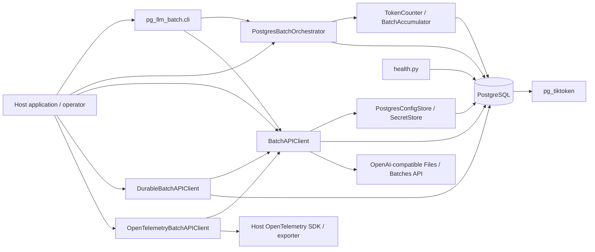
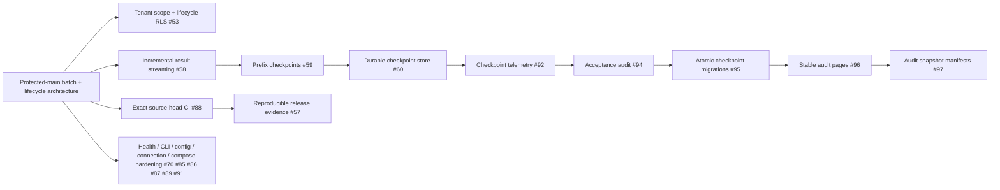

# pg-llm-batch Architecture

## Document authority

This document is the root architectural map for `pg-llm-batch`. It deliberately separates **protected-main as-built** behavior from the **active-PR overlay**. The as-built section is grounded in protected `main` at `bf2cc2e140dc3ff4a56c3203f80f41bb9fed5d10`; active PRs are directional integration work and are not shipped merely because they appear below.

Detailed requirements live in `docs/product/PRD.md` and `docs/product/TRD.md`. Behavior/deployment diagrams live in `docs/architecture/UML.md`; persistence cardinality lives in `docs/architecture/ERD.md`; security ownership lives in `docs/THREAT_MODEL.md`.

## 1. Protected-main as-built

### 1.1 System purpose

`pg-llm-batch` is a PostgreSQL-centered batch engine. It accepts database-backed LLM request state, counts tokens through `pg_tiktoken`, prepares bounded JSONL payloads in PostgreSQL, submits/polls/waits/cancels/retrieves through an OpenAI-compatible Batch API, and optionally persists validated remote lifecycle observations and emits host-owned OpenTelemetry operation signals.

### 1.2 Logical component topology

### 1.3 Module responsibilities

| Module | Responsibility | Must not own |
| --- | --- | --- |
| `token_counter.py` | model/tokenizer lookup, token counting, batch resource accounting | provider credentials, remote lifecycle |
| `orchestrator.py` | resolve batch identity, select queued requests, bounded payload assembly, transactional persistence | provider HTTP policy |
| `batch_api_client.py` | provider destination/resource/path validation, upload/create/poll/wait/cancel/retrieve, bounded HTTP/JSON/download/retry behavior | tenant authorization, global telemetry configuration |
| `durable_client.py` | reserve observation order before provider call; persist validated lifecycle snapshots | authentication of host tenant/user |
| `config.py` | database-backed config and secrets | external secret-management policy for embedding hosts |
| `db.py` | schema application and database helpers, virtual payload loading, lifecycle persistence | provider networking |
| `observability.py` | opt-in operation telemetry with bounded attributes | global SDK/exporter/resource configuration |
| `health.py` | readiness aggregation and minimal HTTP health serving | general web application serving |
| `cli.py` | standalone operator composition | higher-level workflow orchestration |

## 2. Data flow

### 2.1 Preparation path

1. A host/operator identifies an existing batch by UUID or supported lookup key.
2. `PostgresBatchOrchestrator` reads queued, unassigned `llm_requests` for that batch.
3. `TokenCounter` consults configuration/model-tokenizer mapping and `pg_tiktoken`; `BatchAccumulator` counts and partitions the in-memory request rows under token/byte/record limits before preparation persistence begins.
4. Under one advisory-locked PostgreSQL preparation transaction, `_persist_payloads()` first persists each payload document in `llm_batch_file_payloads`, then its `llm_batch_files` row, then JSONL line rows and queued-request assignments, and finally batch totals before commit.
5. Any exception before commit rolls back that preparation transaction rather than leaving a partially committed file/request/line assignment from that invocation.
6. A virtual `memory://<file_id>` path refers back to PostgreSQL; package-owned payload files are not written to disk.

### 2.2 Provider path

1. `BatchAPIClient` resolves a credential set for a validated endpoint alias.
2. It validates the credential-bearing gateway destination before making the authenticated request.
3. It streams the selected PostgreSQL payload to the provider Files API.
4. It creates a remote batch job, polls/waits for terminal state, and retrieves output/error files under finite request and decoded-byte bounds.
5. GET retries are bounded and limited to the protected-main reviewed set. Side-effecting POST operations are not automatically replayed.

### 2.3 Durable lifecycle path

`DurableBatchAPIClient` composes the base provider client rather than replacing it. Before each lifecycle operation it persists a database-owned observation ordering reservation. After a provider response succeeds, it revalidates remote identity/optional file identifiers/status/metadata and writes a projection into `llm_remote_batch_jobs`. Reservation failure prevents provider I/O; persistence failure after provider success produces explicit reconciliation evidence rather than pretending the provider operation did not happen.

## 3. Trust and authority boundaries

### 3.1 PostgreSQL

PostgreSQL is trusted as the package-owned durable state boundary for current-main configuration, secrets, preparation state, endpoint/model mapping, and remote lifecycle projection. Database administrator/superuser power remains outside package-enforced guarantees.

### 3.2 Provider

The provider is an external system. URLs, resource IDs, endpoint paths, response statuses, metadata, JSON bodies, JSONL content, timing guidance, and errors are untrusted until validated by the relevant bounded contract.

### 3.3 Credentials

The built-in path stores provider URL configuration in `com_config` and provider API keys in `com_secrets`; a host can inject another credential provider. Environment variables are bootstrap transport only where explicitly documented. The package must not infer user/tenant authorization from provider data.

### 3.4 Host application

The host owns user/workload authentication, mapping to trusted tenant scope where tenancy is used, external business transactions, global OpenTelemetry policy, ingress/WAF/service-mesh policy, infrastructure TLS/trust stores, backup/restore, retention, and any cross-system exactly-once strategy.

### 3.5 GitHub / release evidence

Source code, PR base, live base tip, GitHub synthetic merge commit, workflow checkout commit, check result, formal review, branch/ruleset policy, and release artifact evidence are separate authority classes. The repository may require all of them, but none silently substitutes for another.

## 4. Resource-bound architecture

Protected main establishes finite bounds for:

- request timeout (`DEFAULT_REQUEST_TIMEOUT_SECONDS`);
- provider control JSON (`DEFAULT_MAX_CONTROL_RESPONSE_BYTES`);
- provider-file decoded bytes (`DEFAULT_MAX_DOWNLOAD_BYTES`);
- download chunk size;
- retry attempt count and delay ceiling;
- remote resource identifier/path syntax;
- batch token, record, and provider file constraints; and
- wait timeout/poll interval supplied by the caller.

The architectural rule is **bound before materialization or repeat**. If an adapter cannot expose the required bounded stream, the package fails closed rather than falling back to an unbounded body read.

## 5. Deployment architecture

### 5.1 Standalone

The bundled Compose profile builds a PostgreSQL image with required extensions and a Python component image. The component receives the DSN as bootstrap transport and serves the current health endpoint. The host/operator owns network publishing, firewalling, persisted Docker volume lifecycle, and production-grade ingress. The current protected-main Compose file publishes 5432 and 8080 without a host IP; #91 is the ACTIVE-PR hardening target for loopback publishing.

### 5.2 Embedded library / submodule

An embedding application imports `TokenCounter`, `PostgresBatchOrchestrator`, `BatchAPIClient`/`DurableBatchAPIClient`, and configuration seams directly. It may apply the package schema to an existing database and supply its own credential resolver. The package does not require a separate network hop between the host and these Python APIs.

### 5.3 CWL MSA interoperability

In a ContextualWisdomLab deployment, another service can own authentication, tenant routing, secret resolution, model/gateway selection, and OpenTelemetry export while `pg-llm-batch` remains a bounded batch/persistence module. This is an integration topology, not a dependency on a particular CWL service.

## 6. Failure architecture

### 6.1 Local validation failure

Invalid config, runtime limits, IDs, endpoint paths, or gateway destinations fail before the external/database effect that relies on them wherever the implementation contract permits.

### 6.2 Provider transport/status failure

The base client converts reviewed failures into structured package exceptions. Bounded idempotent GET failures may retry; non-idempotent operations do not gain retry simply because a network error occurred.

### 6.3 Provider-success / persistence-failure split

Durable lifecycle persistence occurs after provider success for the corresponding observation. A database failure at that point is explicitly a reconciliation case; the package must not hide the remote effect by rewriting it as a pre-request failure.

### 6.4 Telemetry failure

Optional observer failure is best effort and cannot replace the application result/error. The host still owns telemetry backend availability and retention.

### 6.5 Readiness failure

Readiness fails when required DB/tokenizer/config components are not available. Current protected main exposes local diagnostic detail in the health response; #70 is the ACTIVE-PR hardening target for public redaction and bounded concurrent/read work.

## 7. Active-PR overlay

The following overlay is intentionally **not** part of the protected-main as-built architecture until integrated:

The checkpoint nodes above are the current active implementation chain. Superseded predecessor lineages are indexed in `docs/adr/README.md` and are deliberately excluded from this ACTIVE-PR overlay; their old evidence does not transfer to replacements.

The overlay is dependency-aware, not a claim that every PR must merge in the diagram's visual order; the live PR stack/base relations remain authoritative.

## 8. Architecture invariants

1. **Standalone operation is first-class.** A host integration may add services, but core package behavior must not require them.
2. **PostgreSQL and provider authority stay explicit.** Local durable state does not magically authenticate external provider truth.
3. **Side effects are not casually replayed.** Automatic retry is a reviewed method/status/transport contract.
4. **Large data is bounded before full materialization.** Streaming exists to enforce memory bounds, not merely as an implementation detail.
5. **Host authority remains host-owned.** Authentication, tenant mapping, external business effects, global telemetry and ingress do not silently move into this library.
6. **Active PR is not shipped architecture.** Every overlay item must be relabeled after merge/closure/supersession.
7. **Evidence identity is architectural.** Commercial/release decisions must know which source/base/merge/check/review/artifact they are proving.
8. **Database names are descriptive.** New package-owned objects use descriptive two-or-more-word snake_case by default.

## 9. Architecture decision and detail map

- Product outcomes: `docs/product/PRD.md`
- Technical requirements: `docs/product/TRD.md`
- UML: `docs/architecture/UML.md`
- ERD/data model: `docs/architecture/ERD.md`
- Security/threats: `docs/THREAT_MODEL.md`
- Tests/evidence: `docs/TEST_STRATEGY.md`
- Operations/recovery: `docs/OPERABILITY.md`
- Traceability: `docs/TRACEABILITY.md`
- ADR index: `docs/adr/README.md`
- Maintenance governance: `docs/automation/ADR-0001-work-conserving-maintenance.md`
- Evidence identity/writer lease: `docs/automation/ADR-0002-evidence-identity-and-writer-lease.md`

## 10. Change discipline

A runtime, schema, API, security, deployment, CI, evidence, or release change that contradicts an invariant above requires either an ADR update/new ADR or an explicit correction to this architecture in the same change set. PR-body prose alone is not a durable architecture decision.
