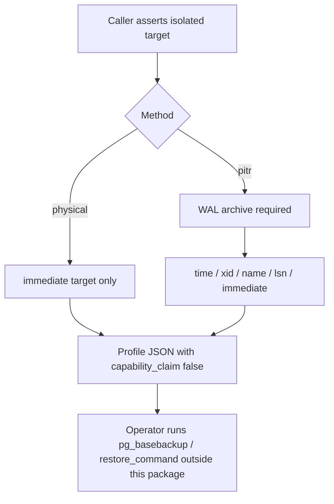

# ADR 0019: Bind a caller-owned physical/WAL/PITR recovery profile

- **Status:** Accepted for the bounded physical/PITR profile seam
- **Date:** 2026-08-16

## Context

Protected main already records content-free logical-recovery receipts and
artifact/schema integrity evidence. Issue #204 still requires a separately
reviewed physical/WAL/PITR profile. A buyer who can dump and restore SQL still
cannot state, in machine-readable form, whether recovery is crash-consistent
only or can follow time.

PostgreSQL continuous archiving uses a base backup plus a WAL archive and a
recovery target (`immediate`, time, transaction identifier, named restore
point, or LSN). Those choices are deployer-owned. The package must not execute
`pg_basebackup`, invent an RPO/RTO, or treat a physical base backup as a
point-in-time restore.

## Decision

`bind_postgres_physical_recovery_profile()` records one caller-owned profile:

- `backup_method` is exactly `physical` or `pitr`.
- `recovery_target_kind` is exactly `immediate`, `time`, `xid`, `name`, or `lsn`.
- Point-in-time kinds require `backup_method="pitr"`.
- `pitr` requires `wal_archive_required=True`.
- `wal_archive_required=False` on a physical+immediate profile means no
  continuous WAL archive. It does not waive backup-internal WAL required to
  reach crash consistency (`pg_basebackup -X stream` or `-X fetch`).
- `immediate` is end-of-backup consistency. Replay-to-end-of-archive is the
  absence of a `recovery_target*` setting and is not a recorded kind.
- `isolated_target_prepared` must be the exact boolean `True`.
- Optional `rpo_seconds` and `rto_seconds` are deployer-selected objectives.
- Emitted evidence always sets `package_capability_claim` to `False`.

The seam does not receive archive paths, DSNs, WAL locations, or restore
commands, and it does not start PostgreSQL tools.

## Proposed recovery-target configuration observation handoff

PR #299 adds a separate read-only observation seam after the deployer has
configured recovery and connected to an isolated recovery target. This section
records that branch-local integration contract; it does not promote the active
PR to protected or released authority before normal review and integration.

`observe_postgres_recovery_target_configuration()` snapshots one exact reviewed
`PostgresPitrRecoveryTarget`, executes one fixed catalog-qualified read, and
compares the effective server state against that target. The query is bounded
to these eight `pg_settings` names plus `pg_is_in_recovery()`:

- `recovery_target`;
- `recovery_target_action`;
- `recovery_target_inclusive`;
- `recovery_target_lsn`;
- `recovery_target_name`;
- `recovery_target_time`;
- `recovery_target_timeline`;
- `recovery_target_xid`.

The observer requests at most one row beyond the eight-setting budget so that
unexpected result growth fails closed instead of being materialized without a
bound. It rejects malformed rows, duplicate or unknown setting names, oversized
setting text, `pending_restart=true`, a target that is no longer in recovery,
and any mismatch with the reviewed target authority. PostgreSQL documents
`pg_settings.pending_restart` as the indicator that a configuration-file
change still requires restart, while `pg_is_in_recovery()` reports whether
recovery remains in progress.

The caller owns the already-connected database connection and its timeout
policy. The seam does not issue configuration writes or silently change session
state. Successful evidence is content-free live-object provenance: it does not
contain DSNs, credentials, recovery-target values, restore-point names,
filesystem paths, or dynamic database exception text.

This observation is deliberately narrower than recovery completion. It does
not create `recovery.signal`, supply `restore_command`, replay or validate WAL,
prove archive completeness or timeline ancestry, prove target attainment,
pause or promote recovery, prove application readiness, or establish achieved
RPO/RTO, HA/DR, CSAP, SOC 2, or certification claims. The profile binder owns
the deployer-selected recovery intent; the observer only verifies the bounded
effective configuration of an already-running recovery target.

## Consequences

Hosts can persist a reviewed physical/PITR contract next to #205 receipts
without claiming that this package completed backup, restore, CSAP, or SOC 2.
Logical restore (#208/#212) remains a separate executor. Live WAL replay and
base-backup execution remain later #204 slices.

The proposed #299 handoff gives operators a fail-closed configuration check
between intent binding and later replay/readiness evidence without combining
those aggregates or extending the transaction boundary around network or
recovery work.

## Rollback

Delete the profile module, tests, and this decision record. No schema
migration is required. If the #299 observation handoff is not integrated,
remove only the proposed handoff section and its focused documentation
contract; do not rewrite the accepted physical/PITR profile decision.

## References

Swanson, M., Bowen, P., Phillips, A., Gallup, D., & Lynes, D. (2010).
*Contingency planning guide for federal information systems* (NIST Special
Publication 800-34 Rev. 1). National Institute of Standards and Technology.
https://doi.org/10.6028/NIST.SP.800-34r1

The PostgreSQL Global Development Group. (2026). *Continuous archiving and
point-in-time recovery (PITR)*. PostgreSQL 18 documentation.
https://www.postgresql.org/docs/18/continuous-archiving.html

The PostgreSQL Global Development Group. (2026). *pg_basebackup*. PostgreSQL 18
documentation. https://www.postgresql.org/docs/18/app-pgbasebackup.html

The PostgreSQL Global Development Group. (2026). *pg_settings*. PostgreSQL 18
documentation.
https://www.postgresql.org/docs/18/view-pg-settings.html

The PostgreSQL Global Development Group. (2026). *System administration
functions*. PostgreSQL 18 documentation.
https://www.postgresql.org/docs/18/functions-admin.html
