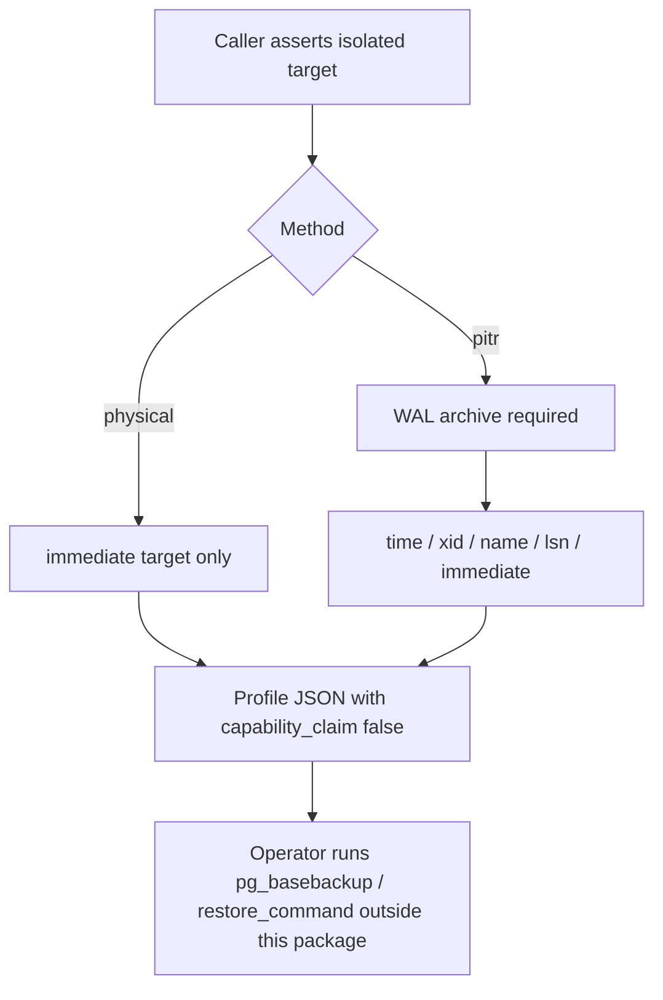

# ADR 0019: Bind a caller-owned physical/WAL/PITR recovery profile

- **Status:** Accepted for the bounded physical/PITR profile seam
- **Date:** 2026-08-16

## Context

Protected main already records content-free logical-recovery receipts and
artifact/schema integrity evidence. Issue #204 still requires a separately
reviewed physical/WAL/PITR profile. A buyer who can dump and restore SQL still
cannot state, in machine-readable form, whether recovery is crash-consistent
only or can follow time.

PostgreSQL continuous archiving uses a base backup plus a WAL archive and a
recovery target (`immediate`, time, transaction identifier, named restore
point, or LSN). Those choices are deployer-owned. The package must not execute
`pg_basebackup`, invent an RPO/RTO, or treat a physical base backup as a
point-in-time restore.

## Decision

`bind_postgres_physical_recovery_profile()` records one caller-owned profile:

- `backup_method` is exactly `physical` or `pitr`.
- `recovery_target_kind` is exactly `immediate`, `time`, `xid`, `name`, or `lsn`.
- Point-in-time kinds require `backup_method="pitr"`.
- `pitr` requires `wal_archive_required=True`.
- `isolated_target_prepared` must be the exact boolean `True`.
- Optional `rpo_seconds` and `rto_seconds` are deployer-selected objectives.
- Emitted evidence always sets `package_capability_claim` to `False`.

The seam does not receive archive paths, DSNs, WAL locations, or restore
commands, and it does not start PostgreSQL tools.

## Consequences

Hosts can persist a reviewed physical/PITR contract next to #205 receipts
without claiming that this package completed backup, restore, CSAP, or SOC 2.
Logical restore (#208/#212) remains a separate executor. Live WAL replay and
base-backup execution remain later #204 slices.

## Rollback

Delete the profile module, tests, and this decision record. No schema
migration is required.

## References

Swanson, M., Bowen, P., Phillips, A., Gallup, D., & Lynes, D. (2010).
*Contingency planning guide for federal information systems* (NIST Special
Publication 800-34 Rev. 1). National Institute of Standards and Technology.
https://doi.org/10.6028/NIST.SP.800-34r1

The PostgreSQL Global Development Group. (2026). *Continuous archiving and
point-in-time recovery (PITR)*. PostgreSQL 18 documentation.
https://www.postgresql.org/docs/18/continuous-archiving.html

The PostgreSQL Global Development Group. (2026). *pg_basebackup*. PostgreSQL 18
documentation. https://www.postgresql.org/docs/18/app-pgbasebackup.html
