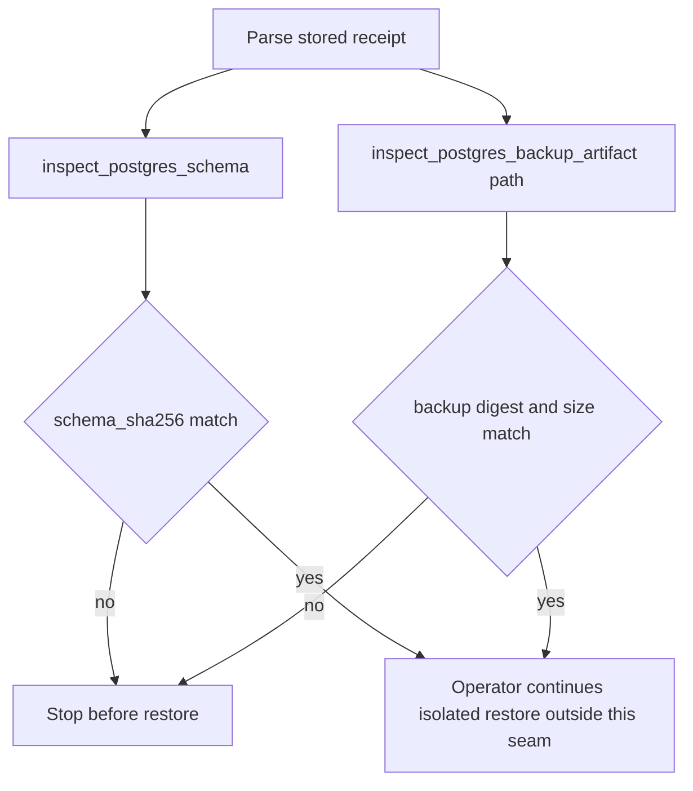

# ADR 0020: Verify stored receipts by re-inspecting current bytes

- **Status:** Accepted for the bounded receipt-verification seam
- **Date:** 2026-08-16

## Context

Protected main already records content-free `PostgresRecoveryReceipt` metadata
and can inspect packaged schema bytes and a caller-owned backup artifact.
Draft #218 compared a receipt to caller-supplied `PostgresSchemaEvidence` and
`PostgresBackupArtifactEvidence` objects. Those types are public frozen
dataclasses with ordinary constructors. Requiring `type(x) is ...` rejects
subclasses but does not establish inspection provenance: a caller can
fabricate exact-type objects whose digests match a fabricated or stored
receipt without `inspect_postgres_schema()` or
`inspect_postgres_backup_artifact()` observing the current bytes.

#218 also reused ADR number 0018, which #216 already allocated for restore
catalog acceptance. That numeric collision is why this record is 0020.
Numeric ADR prefixes must stay unique.

## Decision

`verify_postgres_recovery_receipt()` accepts only:

- an exact `PostgresRecoveryReceipt`; and
- `backup_artifact_path`, the same caller-owned artifact authority used by
  `inspect_postgres_backup_artifact()`.

It always re-inspects the packaged schema and the named artifact, then
compares `schema_sha256` and `backup_sha256` / `backup_size_bytes` with
equal-length constant-time digest matching. Exact-type evidence objects are
not parameters. Parallel digest, size, DSN, credential, `service_name`,
tenant-scope, and backup-byte arguments are not accepted.

This decision record is ADR 0020. ADR 0018 remains reserved for #216 restore
catalog acceptance. A repository test rejects duplicate numeric prefixes.

## Consequences

Hosts can prove that a stored receipt still names the bytes about to be
restored without treating constructed evidence objects as inspection
provenance. The seam does not execute `pg_dump` or `pg_restore`, lock the
artifact against later mutation (CWE-367), or claim RPO/RTO, CSAP, or SOC 2
readiness. Binding remains #215. Logical restore remains #208/#212.

## Rollback

Delete the verification module, tests, doctoring, and this decision record.
No schema migration is required.

## References

National Institute of Standards and Technology. (2015). *Secure hash standard
(SHS)* (FIPS PUB 180-4). https://doi.org/10.6028/NIST.FIPS.180-4

Joint Task Force. (2020). *Security and privacy controls for information
systems and organizations* (NIST Special Publication 800-53 Rev. 5).
National Institute of Standards and Technology.
https://doi.org/10.6028/NIST.SP.800-53r5

MITRE. (2026). *CWE-367: Time-of-check time-of-use (TOCTOU) race condition*.
https://cwe.mitre.org/data/definitions/367.html

The PostgreSQL Global Development Group. (2026). *Backup and restore*.
PostgreSQL 18 documentation. https://www.postgresql.org/docs/18/backup.html
