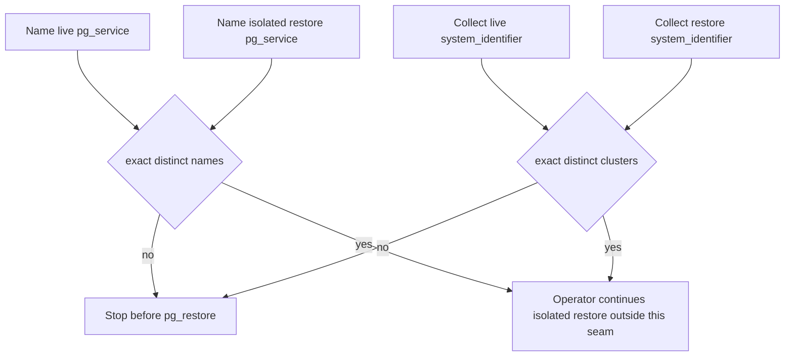

# ADR 0022: Isolate restore-target libpq service names

- **Status:** Accepted for the bounded restore-target identity seam
- **Date:** 2026-08-16

## Context

Protected main can inspect packaged schema bytes and a caller-owned backup
artifact. Active writers own `pg_dump` (#208), custom-format `pg_restore`
(#212), receipt binding (#215), catalog acceptance (#223), receipt
re-inspection (#221), and the physical/PITR profile (#219).

Pull request `#212` accepts one `service_name` and does not compare it to
the live service. An operator can therefore point `pg_restore` at the
production `pg_service.conf` entry and still satisfy the restore executor.
A second service name is also insufficient: two sections or DNS aliases can
resolve to the same host, port, database, and cluster. NIST SP 800-34 treats
an alternate processing site as a distinct recovery identity, not a reuse of
the live system (Swanson et al., 2010). PostgreSQL publishes
`system_identifier` from `pg_control_system()` as the stable cluster
identity for one initialized data directory (The PostgreSQL Global
Development Group, 2026).

## Decision

`verify_postgres_restore_target_isolation()` accepts only:

- `live_service_name`;
- `restore_service_name`;
- `live_target_identity`; and
- `restore_target_identity`.

Both names must be exact built-in strings matching the same libpq
service-name grammar used by the logical dump and restore executors. Both
identities must be exact `PostgresRestoreTargetIdentity` values whose
`system_identifier` fields differ. The names must also differ. DSNs,
passwords, hosts, ports, `tenant_scope`, and backup-byte arguments are not
accepted. The package does not open a connection or read `pg_service.conf`.
Callers collect `system_identifier` from connections they already opened.
This record is ADR 0022 so it does not collide with #212 ADR 0016, #215 ADR
0017, #223 ADR 0018, #219 ADR 0019, #221 ADR 0020, or #222 ADR 0021.

## Consequences

Hosts can prove the restore-drill service name and cluster identifier are
not the live target before they invoke `pg_restore`. Distinct names without
distinct `system_identifier` values fail closed. The seam does not execute
dump or restore, open a connection, or claim RPO/RTO, CSAP, or SOC 2
readiness. It never emits a package capability claim. Logical restore
remains #208/#212. Catalog acceptance remains #223.

## Rollback

Delete the isolation module, tests, doctoring, and this decision record.
No schema migration is required.

## References

Swanson, M., Bowen, P., Phillips, A., Gallup, D., & Lynes, D. (2010).
*Contingency planning guide for federal information systems* (NIST
Special Publication 800-34 Rev. 1). National Institute of Standards and
Technology. https://doi.org/10.6028/NIST.SP.800-34r1

Joint Task Force. (2020). *Security and privacy controls for information
systems and organizations* (NIST SP 800-53 Rev. 5).
National Institute of Standards and Technology.
https://doi.org/10.6028/NIST.SP.800-53r5

MITRE. (2026). *CWE-669: Incorrect resource transfer between spheres*.
https://cwe.mitre.org/data/definitions/669.html

The PostgreSQL Global Development Group. (2026). *Backup and restore*.
PostgreSQL 18 documentation. https://www.postgresql.org/docs/18/backup.html

The PostgreSQL Global Development Group. (2026). *The connection service
file*. PostgreSQL 18 documentation.
https://www.postgresql.org/docs/18/libpq-pgservice.html

The PostgreSQL Global Development Group. (2026). *System administration
functions*. PostgreSQL 18 documentation.
https://www.postgresql.org/docs/18/functions-admin.html
