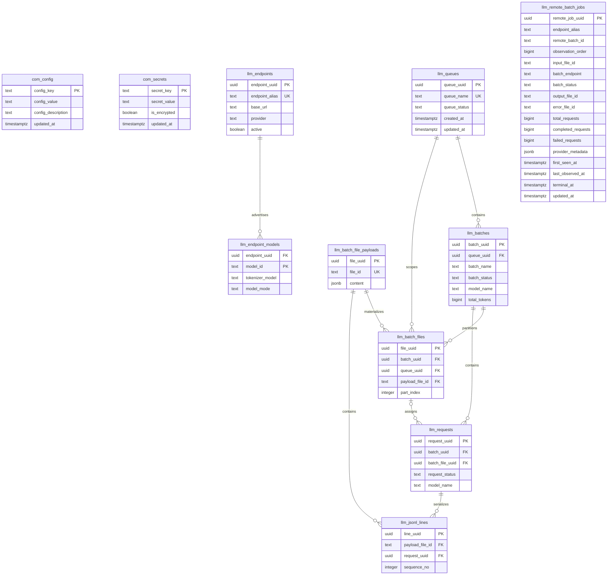
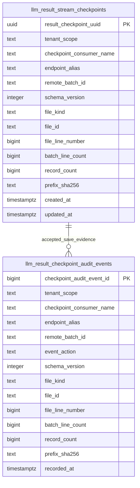

# Logical data model / ERD

## Authority

The protected-main schema in `pg_llm_batch/schema.sql` is the authority for **IMPLEMENTED-ON-PROTECTED-MAIN** persistence. Open pull requests may add tables or constraints; those are shown only as **ACTIVE-PR** overlays. This document does not invent persistence to satisfy diagram coverage.

## Protected-main persisted model

All entities above are **IMPLEMENTED-ON-PROTECTED-MAIN** at the documentation baseline. `llm_remote_batch_jobs` uses composite UNIQUE `(endpoint_alias, remote_batch_id)` as the durable provider-facing identity and idempotency key on protected main; `remote_job_uuid` remains its row primary key. ACTIVE-PR #53 introduces trusted tenant qualification and forced RLS for the remote lifecycle projection; that tenant boundary is not claimed here as shipped.

The protected-main content-bearing work tables `llm_queues`, `llm_batches`, `llm_batch_files`, `llm_batch_file_payloads`, `llm_requests`, and `llm_jsonl_lines` are **not tenant-qualified**. ACTIVE-PR #53 is a **remote lifecycle** isolation slice and does not retrofit those core tables. Issue #130 is the PLANNED follow-up for tenant-scoped content-bearing work state after the protected #53 and #87 results can be composed safely. This ERD therefore does not imply end-to-end tenant isolation and does not invent `tenant_scope` columns, keys, policies, or relationships that do not yet exist.

## ACTIVE-PR persistence overlay

The following persistence exists in open implementation branches and remains **ACTIVE-PR** until integrated:

- `llm_result_stream_checkpoints` — introduced by #60; tenant-qualified durable checkpoint CAS state with forced RLS.
- `llm_result_checkpoint_audit_events` — carried by the current audit replacement #94; append-only accepted-save evidence with forced RLS and immutability triggers.

The relationship is logical: the audit event copies the accepted checkpoint identity/evidence. The current migration does not declare a foreign key between the two tables, so the ERD intentionally does not imply database-enforced referential integrity.

## Ownership and non-persistence boundaries

Provider credentials are represented in `com_config`/`com_secrets` according to the current package contract, but external provider objects, HTTP responses, model inventories, GitHub review evidence, and scheduler state are not application tables in this schema. GitHub checks/reviews/workflow runs are operational evidence, not rows in pg-llm-batch's product database. CWL sibling services remain separate bounded contexts and must not gain hidden direct access to these tables through this documentation.

## Migration discipline

Schema changes must have explicit forward and rollback/recovery treatment, deterministic tests, protected-main/ACTIVE-PR maturity labeling, and updated traceability. A migration present only in an open PR remains **ACTIVE-PR** even if its SQL has passed branch-local integration tests.
