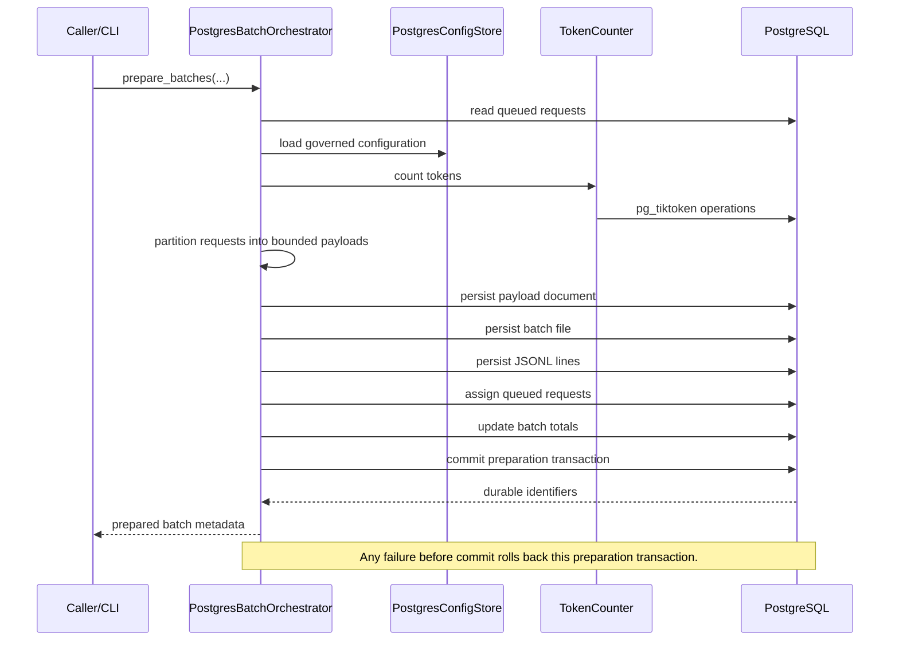
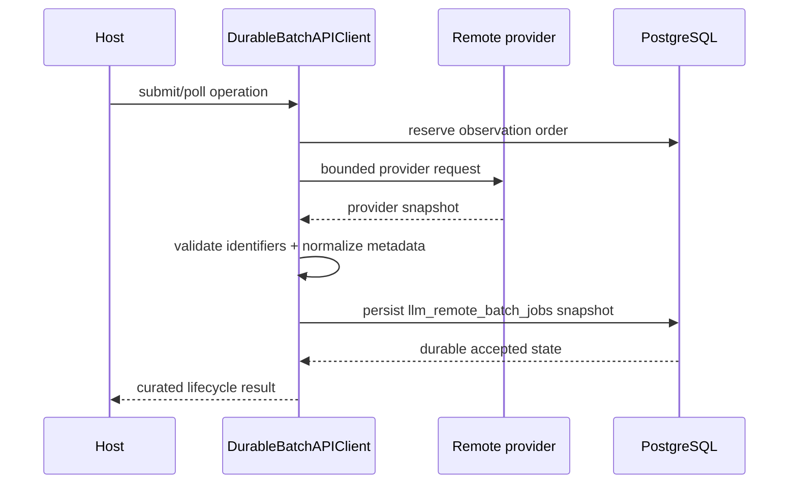
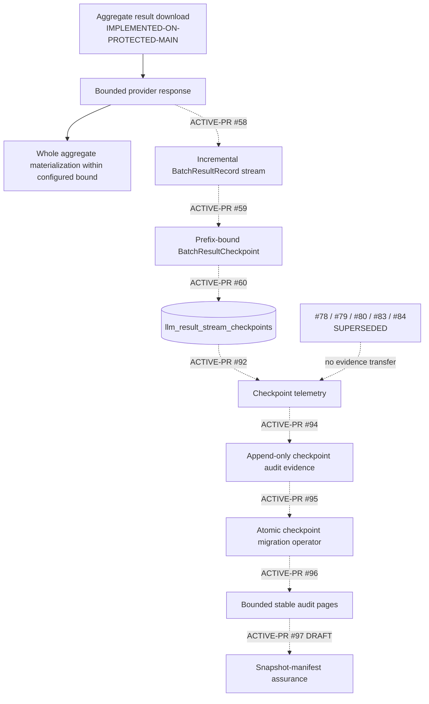
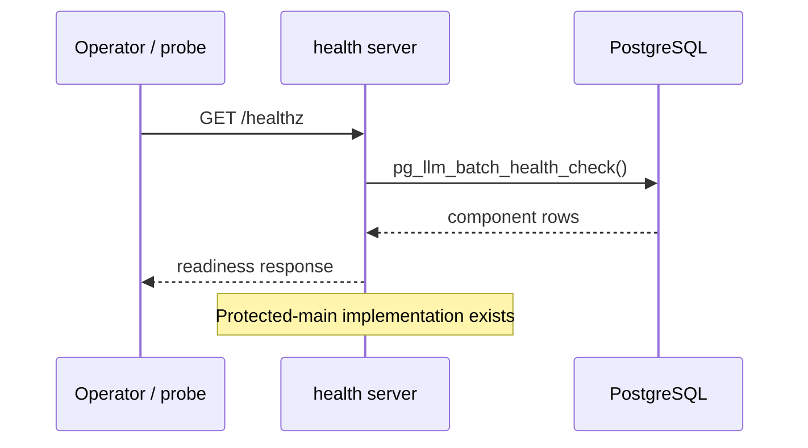
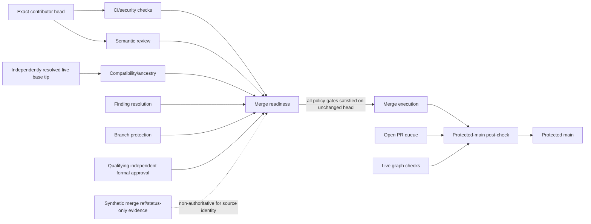
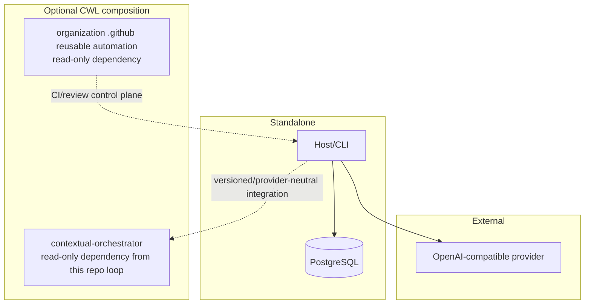

# UML and behavior views

## Status and authority

This document is **ACTIVE-PR** until the documentation PR reaches protected `main`. Nodes labelled `IMPLEMENTED-ON-PROTECTED-MAIN` describe behavior present on protected `main` at the documentation baseline; nodes labelled `ACTIVE-PR` describe open implementation work and are not shipped claims.

## 1. Protected-main component topology

```mermaid
flowchart LR
    CLI[CLI\nIMPLEMENTED-ON-PROTECTED-MAIN] --> ORCH[PostgresBatchOrchestrator\nIMPLEMENTED-ON-PROTECTED-MAIN]
    ORCH --> CFG[Postgres config + secret stores\nIMPLEMENTED-ON-PROTECTED-MAIN]
    ORCH --> TOK[pg_tiktoken token counter\nIMPLEMENTED-ON-PROTECTED-MAIN]
    ORCH --> DB[(PostgreSQL schema\nIMPLEMENTED-ON-PROTECTED-MAIN)]
    CLI --> API[BatchAPIClient\nIMPLEMENTED-ON-PROTECTED-MAIN]
    API --> CRED[CredentialsProvider\nIMPLEMENTED-ON-PROTECTED-MAIN]
    CRED --> CFG
    API --> REMOTE[OpenAI-compatible Files/Batches endpoint\nEXTERNAL]
    API --> DB
    HEALTH[/healthz\nIMPLEMENTED-ON-PROTECTED-MAIN] --> DB
```

## 2. Batch preparation sequence



## 3. Provider request, retry, and response handoff

```mermaid
stateDiagram-v2
    [*] --> ValidateDestination
    ValidateDestination --> AcquireResponse: trusted endpoint + credentials
    AcquireResponse --> RetryDelay: retryable GET acquisition failure/status
    RetryDelay --> AcquireResponse: bounded attempts remain
    AcquireResponse --> HandedOff: response returned to caller
    AcquireResponse --> Failed: permanent/non-retryable or budget exhausted
    HandedOff --> ConsumeBoundedBody
    ConsumeBoundedBody --> Complete
    ConsumeBoundedBody --> FailedAfterHandoff: payload/close failure; no replay
    Complete --> [*]
    Failed --> [*]
    FailedAfterHandoff --> [*]
```



Protected-main retry authority is the code in `pg_llm_batch/batch_api_client.py`; ACTIVE-PR #71 changes the reviewed GET status/error-classification contract and must not be read as shipped until merged.

## 4. Durable remote lifecycle sequence



Tenant-qualified lifecycle and forced-RLS behavior are **ACTIVE-PR** #53 overlays, not protected-main behavior.

## 5. Result streaming and checkpoint overlay



The live replacement order is #92 -> #94 -> #95 -> #96 -> #97. The former #78/#79/#80/#83/#84 chain is **SUPERSEDED**; its checks, reviews, approvals, and base evidence do not transfer to replacement heads. #97 is the current Draft snapshot-manifest successor.

## 6. Health/readiness deployment sequence



## 7. Evidence and merge authority



Merge readiness is not protected-main acceptance. After explicit merge execution, the protected-main post-check revalidates the open PR queue, finding resolution, branch protection, and live graph state under `docs/RELEASE_ACCEPTANCE.md` before integrated behavior is treated as operational evidence.

## 8. Standalone and CWL composition



No CWL service owns pg-llm-batch application tables by direct cross-service database access. Host integrations must use explicit interfaces and preserve standalone operation.
