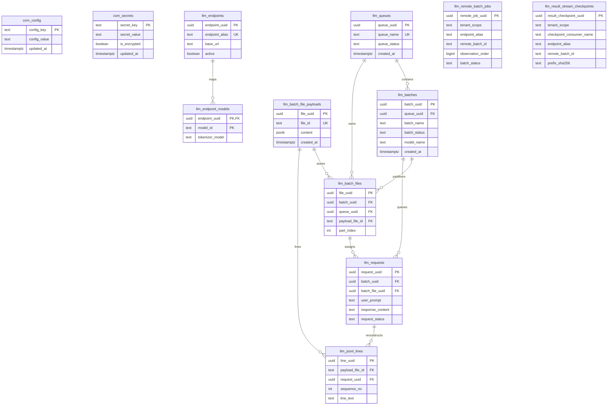

# Package-owned schema ERD

## Authority

This diagram summarizes protected-main package tables from
`pg_llm_batch/schema.sql` plus the migration-owned checkpoint table from
`pg_llm_batch/migrations/0007_result_stream_checkpoints.sql`. SQL and schema
tests remain stronger authority than this picture.

Use it to see identities, foreign keys, and tenant qualification before you
write a report, a restore drill, or an embedding mapping. Do not treat the
diagram as proof that backup/restore, candidate discovery, or distributed
exactly-once processing is shipped.

## What to do next

1. Keep new database objects as two-or-more-word `snake_case` names.
2. Bind `tenant_scope` before reading `llm_remote_batch_jobs` or
   `llm_result_stream_checkpoints`.
3. Treat `llm_result_stream_checkpoints` as prefix evidence, not a distributed
   exactly-once claim.
4. Leave ACTIVE-PR recovery and reconciliation tables off this diagram until
   they exist on protected main.

## Identities

| Table | Durable identity | Notes |
| --- | --- | --- |
| `llm_remote_batch_jobs` | `tenant_scope, endpoint_alias, remote_batch_id` | Forced RLS. Provider data never selects the tenant. |
| `llm_result_stream_checkpoints` | `tenant_scope, checkpoint_consumer_name, endpoint_alias, remote_batch_id` | Added by migration 0007. Forced RLS. |
| `llm_queues` | `queue_uuid` / unique `queue_name` | Standalone preparation owner. |
| `llm_batches` | `batch_uuid` | Child of one queue. |
| `llm_batch_file_payloads` | `file_id` | Canonical JSONL bytes in PostgreSQL. |
| `llm_batch_files` | `(batch_uuid, part_index)` | Virtual payload via `payload_file_id`. |
| `llm_requests` | `request_uuid` | Authorized prompt/result content. |
| `llm_jsonl_lines` | `(payload_file_id, sequence_no)` | JOIN-only reconstruction. |
| `llm_endpoints` | `endpoint_alias` | Configuration, not tenant authority. |
| `com_config` / `com_secrets` | `config_key` / `secret_key` | KV stores. Compatibility secrets may be plaintext. |

## Entity-relationship diagram

`llm_remote_batch_jobs` and `llm_result_stream_checkpoints` are intentionally
unrelated to the preparation graph. Their tenant-qualified unique keys are the
lifecycle and checkpoint identities. Migration 0007 owns the checkpoint table;
the packaged `schema.sql` / Docker init mirror do not create it.

## Third-normal-form boundary

Preparation tables keep queue, batch, payload, request, and line facts in
separate relations with explicit keys. Endpoint/model mapping is a separate
relation from lifecycle projection. The KV tables `com_config` and `com_secrets`
are key/value stores by design: each row is one setting, not a repeating group
inside another entity. Do not add single-word table names or embed tenant
authority in provider columns.
