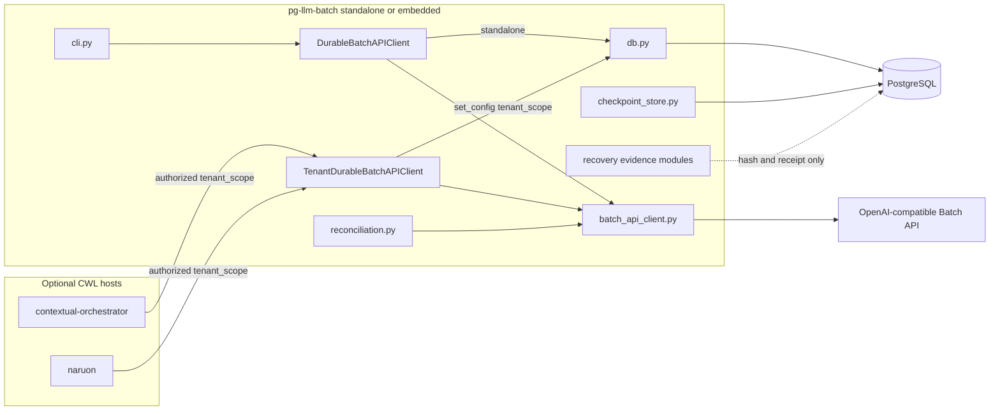
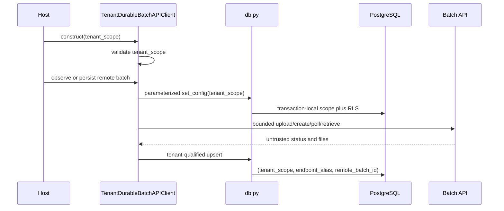

# Component and sequence views

## Authority

These diagrams describe protected-main composition. They do not add runtime
authority and do not promote ACTIVE-PR backup, restore, discovery, or worker
lanes into shipped components.

## What to do next

1. Deploy this package alone, or embed it behind `contextual-orchestrator` /
   `naruon` after those hosts authenticate and authorize.
2. Inject credentials and `tenant_scope` from the host. Do not read them from
   provider responses.
3. Call `DurableBatchAPIClient` for `standalone`. Call
   `TenantDurableBatchAPIClient` only after the host has chosen a scope.

## Component view

`contextual-orchestrator` and `naruon` are optional. The package must keep
working when they are absent.

## Tenant lifecycle sequence

A missing or malformed scope fails before credential lookup, provider I/O, or
lifecycle SQL. `DurableBatchAPIClient` keeps the four-argument recorder seam
and stores under the exact `standalone` scope.
